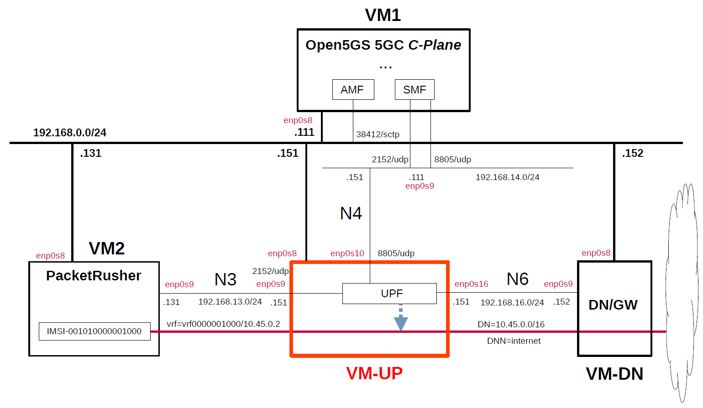

# Simple Measurement of UPF Performance 2
This describes simple performance measurements of several open source UPFs by using [PacketRusher](https://github.com/HewlettPackard/PacketRusher) as the performance measurement tool.
For this measurement, [OsmoUPF](https://gitea.osmocom.org/cellular-infrastructure/osmo-upf) was added since [previous measurement](https://github.com/s5uishida/simple_measurement_of_upf_performance).
PacketRusher is also featured on [HPE Developer Blog](https://developer.hpe.com/blog/open-sourcing-packetrusher-a-5g-core-performance-tester/).

---

### [Sample Configurations and Miscellaneous for Mobile Network](https://github.com/s5uishida/sample_config_misc_for_mobile_network)

---

<a id="toc"></a>

## Table of Contents

- [Simple Overview of UPF Performance Measurements](#overview)
- [Changes in configuration files of Open5GS, free5GC, UPFs and PacketRusher](#changes)
  - [Changes in configuration files of Open5GS 5GC C-Plane](#changes_cp_open5gs)
  - [Changes in configuration files of free5GC 5GC C-Plane](#changes_cp_free5gc)
  - [Changes in configuration files of UPFs](#changes_up)
    - [a-1. Changes in configuration files of Open5GS 5GC UPF (TUN)](#changes_up_a1)
    - [a-2. Changes in configuration files of Open5GS 5GC UPF (TAP)](#changes_up_a2)
    - [b. Changes in configuration files of UPG-VPP](#changes_up_b)
    - [c. Changes in configuration files of eUPF](#changes_up_c)
    - [d. Changes in configuration files of OsmoUPF](#changes_up_d)
    - [e. Changes in configuration files of free5GC 5GC UPF](#changes_up_e)
  - [Changes in configuration files of PacketRusher](#changes_pr)
- [Network settings of UPFs and Data Network Gateway](#network_settings)
  - [a-1. Network settings of Open5GS 5GC UPF (TUN)](#network_settings_up_a1)
  - [a-2. Network settings of Open5GS 5GC UPF (TAP)](#network_settings_up_a2)
  - [b. Network settings of UPG-VPP](#network_settings_up_b)
  - [c. Network settings of eUPF](#network_settings_up_c)
  - [d. Network settings of OsmoUPF](#network_settings_up_d)
  - [e. Network settings of free5GC 5GC UPF](#network_settings_up_e)
  - [Network settings of Data Network Gateway](#network_settings_dn)
- [Build Open5GS, free5GC, UPFs and PacketRusher](#build)
- [Run Open5GS, free5GC and UPFs](#run)
  - [Run UPFs](#run_up)
    - [a-1. Run Open5GS 5GC UPF (TUN)](#run_up_a1)
    - [a-2. Run Open5GS 5GC UPF (TAP)](#run_up_a2)
    - [b. Run UPG-VPP](#run_up_b)
    - [c. Run eUPF](#run_up_c)
    - [d. Run OsmoUPF](#run_up_d)
    - [e. Run free5GC 5GC UPF](#run_up_e)
  - [Run 5GC C-Plane](#run_cp)
    - [Run Open5GS 5GC C-Plane](#run_cp_open5gs)
    - [Run free5GC 5GC C-Plane](#run_cp_free5gc)
- [Measure using PacketRusher](#measure)
  - [Run PacketRusher on VM2](#run_packet_rusher)
  - [Run iPerf3 server on Data Network Gateway (VM-DN)](#run_iperf3_server)
  - [Try ping and iPerf3 client on VM2](#try_ping_iperf3)
- [Results](#results)
- [Changelog (summary)](#changelog)

---

<a id="overview"></a>

## Simple Overview of UPF Performance Measurements

Using Open5GS for 5GC, I will easily measure the performance of several open source UPFs with PacketRusher.
**Note that this configuration is implemented with Virtualbox VMs.**

The following minimum configuration was set as a condition.
- Only one each for C-Plane, U-Plane(UPF) and RAN&UE(performance measurement tool).

The built simulation environment is as follows.

</img>

The 5GC / RAN&UE used are as follows.

- 5GC - Open5GS v2.7.2 (2024.09.04) - https://github.com/open5gs/open5gs  
  *for Open5GS UPF, UPG-VPP, eUPF and OsmoUPF*
- 5GC - free5GC v3.4.3 (2024.09.12) - https://github.com/free5gc/free5gc  
  *for free5GC UPF (go-upf)*
- RAN&UE - PacketRusher 20240521 (2024.06.24) - https://github.com/HewlettPackard/PacketRusher  
  (RAN) - gtp5g v0.9.1 (2024.08.15) - https://github.com/free5gc/gtp5g

The UPFs used are as follows.

- Open5GS UPF v2.7.2 (2024.09.04) - https://github.com/open5gs/open5gs
- UPG-VPP v1.13.0 (2024.03.25) - https://github.com/travelping/upg-vpp
- eUPF v0.6.4 (2024.05.01) - https://github.com/edgecomllc/eupf
- OsmoUPF v0.1.1.109 (2024.08.16) - https://gitea.osmocom.org/cellular-infrastructure/osmo-upf
- free5GC UPF (go-upf) v1.2.3 (2024.05.11) - https://github.com/free5gc/go-upf  
  gtp5g v0.8.10 (2024.06.03) - https://github.com/free5gc/gtp5g

Each VMs are as follows.
| VM | SW & Role | IP address | OS | CPU | Mem | HDD |
| --- | --- | --- | --- | --- | --- | --- |
| VM1 | Open5GS 5GC C-Plane | 192.168.0.111/24 | Ubuntu 24.04 | 1 | 2GB | 20GB |
| **VM-UP** | **each UPF U-Plane**  | **192.168.0.151/24** | **Ubuntu 24.04<br>or 22.04** | **2** | **8GB** | **20GB** |
| VM-DN | Data Network Gateway  | 192.168.0.152/24 | Ubuntu 24.04 | 2 | 2GB | 10GB |
| VM2 | PacketRusher RAN&UE | 192.168.0.131/24 | Ubuntu 24.04 | 2 | 2GB | 10GB |

**Each VM-UP(UPFs) are as follows.**
| # | SW | Date | Commit | OS |
| --- | --- | --- | --- | --- |
| a | Open5GS UPF v2.7.2 | 2024.09.04 | `6d80d4322a6daf4420c39f2edb1d1d8585a577a0` | Ubuntu 24.04 |
| b | UPG-VPP v1.13.0 | 2024.03.25 | `dfdf64000566d35955d7c180720ff66086bd3572` | Ubuntu 22.04 |
| c | eUPF v0.6.4 | 2024.05.01 | `0f704deaca67766733a447f4680cf4d77e638934` | Ubuntu 24.04 |
| d | OsmoUPF v0.1.1.109 | 2024.08.16 | `6859de09d2ae0e363070e152489d9f8579085aa8` | Ubuntu 24.04 |
| e | free5GC UPF<br>(go-upf) v1.2.3 | 2024.05.11 | `922281ba58b6ca42d73be218671c8feae3658420` | Ubuntu 24.04 |

The network interfaces of each VM except VM-UP are as follows.
| VM | Device | Network Adapter | Adapter Type | IP address | Interface |
| --- | --- | --- | --- | --- | --- |
| VM1 | enp0s3 | NAT(default) | 82540EM | 10.0.2.15/24 | (VM default NW) |
| | enp0s8 | Bridged Adapter | 82540EM | 192.168.0.111/24 | (Mgmt NW) |
| | enp0s9 | NAT Network | virtio-net | 192.168.14.111/24 | N4 |
| VM-DN | enp0s3 | NAT(default) | 82540EM | 10.0.2.15/24 | (VM default NW) |
| | enp0s8 | Bridged Adapter | 82540EM | 192.168.0.152/24 | (Mgmt NW) |
| | enp0s9 | NAT Network | virtio-net | 192.168.16.152/24 | N6<br>***default GW for VM-UP*** |
| VM2 | enp0s3 | NAT(default) | 82540EM | 10.0.2.15/24 | (VM default NW) |
| | enp0s8 | Bridged Adapter | 82540EM | 192.168.0.131/24 | (Mgmt NW) |
| | enp0s9 | NAT Network | virtio-net | 192.168.13.131/24 | N3 |

**The network interfaces of each VM-UP(UPFs) are as follows.**
**Note that UPFs from `a` to `d` connect to Open5GS CN, but `e` free5GC UPF does not support FTUP flag in PFCP Association Setup Request/Respose, so it connects to free5GC CN.**
| # | SW | Device | Network Adapter | Adapter Type | IP address | Interface |
| --- | --- | --- | --- | --- | --- | --- |
| a | Open5GS UPF | ~~enp0s3~~ | ~~NAT(default)~~ | ~~82540EM~~ | ~~10.0.2.15/24~~ | ~~(VM default NW)~~<br>***down*** |
| | | enp0s8 | Bridged Adapter | 82540EM | 192.168.0.151/24 | (Mgmt NW) |
| | | enp0s9 | NAT Network | virtio-net | 192.168.13.151/24 | N3 |
| | | enp0s10 | NAT Network | virtio-net | 192.168.14.151/24 | N4 |
| | | enp0s16 | NAT Network | virtio-net | 192.168.16.151/24 | N6 |
| b | UPG-VPP | enp0s3 | NAT(default) | 82540EM | 10.0.2.15/24 | (VM default NW) |
| | | enp0s8 | Bridged Adapter | 82540EM | 192.168.0.151/24 | (Mgmt NW) |
| | | enp0s9 | NAT Network | 82540EM | 192.168.13.151/24 | N3<br>***(Under DPDK<br>by vfio-pci)*** |
| | | enp0s10 | NAT Network | 82540EM | 192.168.14.151/24 | N4<br>***(Under DPDK<br>by vfio-pci)*** |
| | | enp0s16 | NAT Network | 82540EM | 192.168.16.151/24 | N6<br>***(Under DPDK<br>by vfio-pci)*** |
| c | eUPF | ~~enp0s3~~ | ~~NAT(default)~~ | ~~82540EM~~ | ~~10.0.2.15/24~~ | ~~(VM default NW)~~<br>***down*** |
| | | enp0s8 | Bridged Adapter | 82540EM | 192.168.0.151/24 | (Mgmt NW) |
| | | enp0s9 | NAT Network | virtio-net | 192.168.13.151/24 | N3 ***(XDP)*** |
| | | enp0s10 | NAT Network | virtio-net | 192.168.14.151/24 | N4 |
| | | enp0s16 | NAT Network | virtio-net | 192.168.16.151/24 | N6 ***(XDP)*** |
| d | OsmoUPF | ~~enp0s3~~ | ~~NAT(default)~~ | ~~82540EM~~ | ~~10.0.2.15/24~~ | ~~(VM default NW)~~<br>***down*** |
| | | enp0s8 | Bridged Adapter | 82540EM | 192.168.0.151/24 | (Mgmt NW) |
| | | enp0s9 | NAT Network | virtio-net | 192.168.13.151/24 | N3 |
| | | enp0s10 | NAT Network | virtio-net | 192.168.14.151/24 | N4 |
| | | enp0s16 | NAT Network | virtio-net | 192.168.16.151/24 | N6 |
| e | free5GC UPF<br>(go-upf) | ~~enp0s3~~ | ~~NAT(default)~~ | ~~82540EM~~ | ~~10.0.2.15/24~~ | ~~(VM default NW)~~<br>***down*** |
| | | enp0s8 | Bridged Adapter | 82540EM | 192.168.0.151/24 | (Mgmt NW) |
| | | enp0s9 | NAT Network | virtio-net | 192.168.13.151/24 | N3 |
| | | enp0s10 | NAT Network | virtio-net | 192.168.14.151/24 | N4 |
| | | enp0s16 | NAT Network | virtio-net | 192.168.16.151/24 | N6 |

NAT networks of Virtualbox  are as follows.
| Network Name | Network CIDR |
| --- | --- |
| N3 | 192.168.13.0/24 |
| N4 | 192.168.14.0/24 |
| N6 | 192.168.16.0/24 |

The main subscriber Information is as follows.
Please register the subscriber information on each WebConsole of Open5GS and free5GC.
| IMSI | DNN | DN | Key & OPc | S-NSSAI |
| --- | --- | --- | --- | --- |
| 001010000001000 | internet | 10.45.0.0/16 | `Key:465B5CE8B199B49FAA5F0A2EE238A6BC`<br>`OPc:E8ED289DEBA952E4283B54E88E6183CA` | SST:1<br>SD:010203|

<a id="changes"></a>

## Changes in configuration files of Open5GS, free5GC, UPFs and PacketRusher

Please refer to the following for building Open5GS, free5GC, UPFs and PacketRusher respectively.
- Open5GS v2.7.2 (2024.09.04) - https://open5gs.org/open5gs/docs/guide/02-building-open5gs-from-sources/
- free5GC v3.4.3 (2024.09.12) - https://free5gc.org/guide/
- UPG-VPP v1.13.0 (2024.03.25) - https://github.com/s5uishida/install_vpp_upf_dpdk#annex_1
- eUPF v0.6.4 (2024.05.01) - https://github.com/s5uishida/install_eupf
- OsmoUPF v0.1.1.109 (2024.08.16) - https://github.com/s5uishida/install_osmoupf
- free5GC UPF (go-upf) v1.2.3 (2024.05.11) - https://free5gc.org/guide/
- PacketRusher 20240521 (2024.06.24) - https://github.com/HewlettPackard/PacketRusher/wiki

<a id="changes_cp_open5gs"></a>

### Changes in configuration files of Open5GS 5GC C-Plane

- `open5gs/install/etc/open5gs/amf.yaml`
```diff
--- amf.yaml.orig       2024-05-11 22:43:06.000000000 +0900
+++ amf.yaml    2024-05-31 19:06:09.171978977 +0900
@@ -20,29 +20,32 @@
         - uri: http://127.0.0.200:7777
   ngap:
     server:
-      - address: 127.0.0.5
+      - address: 192.168.0.111
   metrics:
     server:
       - address: 127.0.0.5
         port: 9090
   guami:
     - plmn_id:
-        mcc: 999
-        mnc: 70
+        mcc: 001
+        mnc: 01
       amf_id:
         region: 2
         set: 1
   tai:
     - plmn_id:
-        mcc: 999
-        mnc: 70
+        mcc: 001
+        mnc: 01
       tac: 1
   plmn_support:
     - plmn_id:
-        mcc: 999
-        mnc: 70
+        mcc: 001
+        mnc: 01
       s_nssai:
         - sst: 1
+          sd: 1
+        - sst: 1
+          sd: 010203
   security:
     integrity_order : [ NIA2, NIA1, NIA0 ]
     ciphering_order : [ NEA0, NEA1, NEA2 ]
```
- `open5gs/install/etc/open5gs/nrf.yaml`
```diff
--- nrf.yaml.orig       2024-05-11 22:43:06.000000000 +0900
+++ nrf.yaml    2024-05-12 03:26:28.737595527 +0900
@@ -11,8 +11,8 @@
 nrf:
   serving:  # 5G roaming requires PLMN in NRF
     - plmn_id:
-        mcc: 999
-        mnc: 70
+        mcc: 001
+        mnc: 01
   sbi:
     server:
       - address: 127.0.0.10
```
- `open5gs/install/etc/open5gs/smf.yaml`
```diff
--- smf.yaml.orig       2024-06-01 00:21:43.876916232 +0900
+++ smf.yaml    2024-05-12 03:30:16.250185155 +0900
@@ -20,16 +20,13 @@
         - uri: http://127.0.0.200:7777
   pfcp:
     server:
-      - address: 127.0.0.4
+      - address: 192.168.14.111
     client:
       upf:
-        - address: 127.0.0.7
-  gtpc:
-    server:
-      - address: 127.0.0.4
+        - address: 192.168.14.151
   gtpu:
     server:
-      - address: 127.0.0.4
+      - address: 192.168.14.111
   metrics:
     server:
       - address: 127.0.0.4
@@ -37,20 +34,17 @@
   session:
     - subnet: 10.45.0.0/16
       gateway: 10.45.0.1
-    - subnet: 2001:db8:cafe::/48
-      gateway: 2001:db8:cafe::1
+      dnn: internet
   dns:
     - 8.8.8.8
     - 8.8.4.4
-    - 2001:4860:4860::8888
-    - 2001:4860:4860::8844
   mtu: 1400
 #  p-cscf:
 #    - 127.0.0.1
 #    - ::1
 #  ctf:
 #    enabled: auto   # auto(default)|yes|no
-  freeDiameter: /root/open5gs/install/etc/freeDiameter/smf.conf
+#  freeDiameter: /root/open5gs/install/etc/freeDiameter/smf.conf
 
 ################################################################################
 # SMF Info
```

<a id="changes_cp_free5gc"></a>

### Changes in configuration files of free5GC 5GC C-Plane

- `free5gc/config/amfcfg.yaml`
```diff
--- amfcfg.yaml.orig    2024-09-01 09:47:28.519041774 +0900
+++ amfcfg.yaml 2024-09-01 10:18:42.528504816 +0900
@@ -5,7 +5,7 @@
 configuration:
   amfName: AMF # the name of this AMF
   ngapIpList:  # the IP list of N2 interfaces on this AMF
-    - 127.0.0.18
+    - 192.168.0.111
   ngapPort: 38412 # the SCTP port listened by NGAP
   sbi: # Service-based interface information
     scheme: http # the protocol for sbi (http or https)
@@ -24,18 +24,18 @@
   servedGuamiList: # Guami (Globally Unique AMF ID) list supported by this AMF
     # <GUAMI> = <MCC><MNC><AMF ID>
     - plmnId: # Public Land Mobile Network ID, <PLMN ID> = <MCC><MNC>
-        mcc: 208 # Mobile Country Code (3 digits string, digit: 0~9)
-        mnc: 93 # Mobile Network Code (2 or 3 digits string, digit: 0~9)
+        mcc: 001 # Mobile Country Code (3 digits string, digit: 0~9)
+        mnc: 01 # Mobile Network Code (2 or 3 digits string, digit: 0~9)
       amfId: cafe00 # AMF identifier (3 bytes hex string, range: 000000~FFFFFF)
   supportTaiList:  # the TAI (Tracking Area Identifier) list supported by this AMF
     - plmnId: # Public Land Mobile Network ID, <PLMN ID> = <MCC><MNC>
-        mcc: 208 # Mobile Country Code (3 digits string, digit: 0~9)
-        mnc: 93 # Mobile Network Code (2 or 3 digits string, digit: 0~9)
+        mcc: 001 # Mobile Country Code (3 digits string, digit: 0~9)
+        mnc: 01 # Mobile Network Code (2 or 3 digits string, digit: 0~9)
       tac: 000001 # Tracking Area Code (3 bytes hex string, range: 000000~FFFFFF)
   plmnSupportList: # the PLMNs (Public land mobile network) list supported by this AMF
     - plmnId: # Public Land Mobile Network ID, <PLMN ID> = <MCC><MNC>
-        mcc: 208 # Mobile Country Code (3 digits string, digit: 0~9)
-        mnc: 93 # Mobile Network Code (2 or 3 digits string, digit: 0~9)
+        mcc: 001 # Mobile Country Code (3 digits string, digit: 0~9)
+        mnc: 01 # Mobile Network Code (2 or 3 digits string, digit: 0~9)
       snssaiList: # the S-NSSAI (Single Network Slice Selection Assistance Information) list supported by this AMF
         - sst: 1 # Slice/Service Type (uinteger, range: 0~255)
           sd: 010203 # Slice Differentiator (3 bytes hex string, range: 000000~FFFFFF)
```
- `free5gc/config/ausfcfg.yaml`
```diff
--- ausfcfg.yaml.orig   2024-09-01 09:47:28.519041774 +0900
+++ ausfcfg.yaml        2024-09-01 09:55:53.372615743 +0900
@@ -16,10 +16,8 @@
   nrfUri: http://127.0.0.10:8000 # a valid URI of NRF
   nrfCertPem: cert/nrf.pem # NRF Certificate
   plmnSupportList: # the PLMNs (Public Land Mobile Network) list supported by this AUSF
-    - mcc: 208 # Mobile Country Code (3 digits string, digit: 0~9)
-      mnc: 93  # Mobile Network Code (2 or 3 digits string, digit: 0~9)
-    - mcc: 123 # Mobile Country Code (3 digits string, digit: 0~9)
-      mnc: 45  # Mobile Network Code (2 or 3 digits string, digit: 0~9)
+    - mcc: 001 # Mobile Country Code (3 digits string, digit: 0~9)
+      mnc: 01  # Mobile Network Code (2 or 3 digits string, digit: 0~9)
   groupId: ausfGroup001 # ID for the group of the AUSF
   eapAkaSupiImsiPrefix: false # including "imsi-" prefix or not when using the SUPI to do EAP-AKA' authentication
 
```
- `free5gc/config/nrfcfg.yaml`
```diff
--- nrfcfg.yaml.orig    2024-09-01 09:47:28.520041774 +0900
+++ nrfcfg.yaml 2024-09-01 09:56:09.974381863 +0900
@@ -18,8 +18,8 @@
       key: cert/root.key
     oauth: true
   DefaultPlmnId:
-    mcc: 208 # Mobile Country Code (3 digits string, digit: 0~9)
-    mnc: 93 # Mobile Network Code (2 or 3 digits string, digit: 0~9)
+    mcc: 001 # Mobile Country Code (3 digits string, digit: 0~9)
+    mnc: 01 # Mobile Network Code (2 or 3 digits string, digit: 0~9)
   serviceNameList: # the SBI services provided by this NRF, refer to TS 29.510
     - nnrf-nfm # Nnrf_NFManagement service
     - nnrf-disc # Nnrf_NFDiscovery service
```
- `free5gc/config/nssfcfg.yaml`
```diff
--- nssfcfg.yaml.orig   2024-09-01 09:47:28.521041774 +0900
+++ nssfcfg.yaml        2024-09-01 09:56:46.775178233 +0900
@@ -18,12 +18,12 @@
   nrfUri: http://127.0.0.10:8000 # a valid URI of NRF
   nrfCertPem: cert/nrf.pem # NRF Certificate
   supportedPlmnList: # the PLMNs (Public land mobile network) list supported by this NSSF
-    - mcc: 208 # Mobile Country Code (3 digits string, digit: 0~9)
-      mnc: 93 # Mobile Network Code (2 or 3 digits string, digit: 0~9)
+    - mcc: 001 # Mobile Country Code (3 digits string, digit: 0~9)
+      mnc: 01 # Mobile Network Code (2 or 3 digits string, digit: 0~9)
   supportedNssaiInPlmnList: # Supported S-NSSAI List for each PLMN
     - plmnId: # Public Land Mobile Network ID, <PLMN ID> = <MCC><MNC>
-        mcc: 208 # Mobile Country Code (3 digits string, digit: 0~9)
-        mnc: 93 # Mobile Network Code (2 or 3 digits string, digit: 0~9)
+        mcc: 001 # Mobile Country Code (3 digits string, digit: 0~9)
+        mnc: 01 # Mobile Network Code (2 or 3 digits string, digit: 0~9)
       supportedSnssaiList: # Supported S-NSSAIs of the PLMN
         - sst: 1 # Slice/Service Type (uinteger, range: 0~255)
           sd: 010203 # Slice Differentiator (3 bytes hex string, range: 000000~FFFFFF)
```
- `free5gc/config/smfcfg.yaml`
```diff
--- smfcfg.yaml.orig    2024-09-23 13:42:26.577294410 +0900
+++ smfcfg.yaml 2024-09-23 13:51:22.430033125 +0900
@@ -34,14 +34,14 @@
             ipv4: 8.8.8.8
             ipv6: 2001:4860:4860::8888
   plmnList: # the list of PLMN IDs that this SMF belongs to (optional, remove this key when unnecessary)
-    - mcc: 208 # Mobile Country Code (3 digits string, digit: 0~9)
-      mnc: 93 # Mobile Network Code (2 or 3 digits string, digit: 0~9)
+    - mcc: 001 # Mobile Country Code (3 digits string, digit: 0~9)
+      mnc: 01 # Mobile Network Code (2 or 3 digits string, digit: 0~9)
   locality: area1 # Name of the location where a set of AMF, SMF, PCF and UPFs are located
   pfcp: # the IP address of N4 interface on this SMF (PFCP)
     # addr config is deprecated in smf config v1.0.3, please use the following config
-    nodeID: 127.0.0.1 # the Node ID of this SMF
-    listenAddr: 127.0.0.1 # the IP/FQDN of N4 interface on this SMF (PFCP)
-    externalAddr: 127.0.0.1 # the IP/FQDN of N4 interface on this SMF (PFCP)
+    nodeID: 192.168.14.111 # the Node ID of this SMF
+    listenAddr: 192.168.14.111 # the IP/FQDN of N4 interface on this SMF (PFCP)
+    externalAddr: 192.168.14.111 # the IP/FQDN of N4 interface on this SMF (PFCP)
     assocFailAlertInterval: 10s
     assocFailRetryInterval: 30s
     heartbeatInterval: 10s
@@ -51,8 +51,8 @@
         type: AN # the type of the node (AN or UPF)
       UPF: # the name of the node
         type: UPF # the type of the node (AN or UPF)
-        nodeID: 127.0.0.8 # the Node ID of this UPF
-        addr: 127.0.0.8 # the IP/FQDN of N4 interface on this UPF (PFCP)
+        nodeID: 192.168.14.151 # the Node ID of this UPF
+        addr: 192.168.14.151 # the IP/FQDN of N4 interface on this UPF (PFCP)
         sNssaiUpfInfos: # S-NSSAI information list for this UPF
           - sNssai: # S-NSSAI (Single Network Slice Selection Assistance Information)
               sst: 1 # Slice/Service Type (uinteger, range: 0~255)
@@ -60,9 +60,9 @@
             dnnUpfInfoList: # DNN information list for this S-NSSAI
               - dnn: internet
                 pools:
-                  - cidr: 10.60.0.0/16
+                  - cidr: 10.45.0.0/16
                 staticPools:
-                  - cidr: 10.60.100.0/24
+                  - cidr: 10.45.100.0/24
           - sNssai: # S-NSSAI (Single Network Slice Selection Assistance Information)
               sst: 1 # Slice/Service Type (uinteger, range: 0~255)
               sd: 112233 # Slice Differentiator (3 bytes hex string, range: 000000~FFFFFF)
@@ -75,12 +75,14 @@
         interfaces: # Interface list for this UPF
           - interfaceType: N3 # the type of the interface (N3 or N9)
             endpoints: # the IP address of this N3/N9 interface on this UPF
-              - 127.0.0.8
+              - 192.168.13.151
             networkInstances: # Data Network Name (DNN)
               - internet
     links: # the topology graph of userplane, A and B represent the two nodes of each link
       - A: gNB1
         B: UPF
+  ulcl: false
+  nwInstFqdnEncoding: true
   # retransmission timer for pdu session modification command
   t3591:
     enable: true # true or false
```

<a id="changes_up"></a>

### Changes in configuration files of UPFs

<a id="changes_up_a1"></a>

#### a-1. Changes in configuration files of Open5GS 5GC UPF (TUN)

- `open5gs/install/etc/open5gs/upf.yaml`
```diff
--- upf.yaml.orig       2024-05-02 19:52:00.000000000 +0900
+++ upf.yaml        2024-05-19 12:38:00.000000000 +0900
@@ -11,18 +11,18 @@
 upf:
   pfcp:
     server:
-      - address: 127.0.0.7
+      - address: 192.168.14.151
     client:
 #      smf:     #  UPF PFCP Client try to associate SMF PFCP Server
 #        - address: 127.0.0.4
   gtpu:
     server:
-      - address: 127.0.0.7
+      - address: 192.168.13.151
   session:
     - subnet: 10.45.0.0/16
       gateway: 10.45.0.1
-    - subnet: 2001:db8:cafe::/48
-      gateway: 2001:db8:cafe::1
+      dnn: internet
+      dev: ogstun
   metrics:
     server:
       - address: 127.0.0.7
```

<a id="changes_up_a2"></a>

#### a-2. Changes in configuration files of Open5GS 5GC UPF (TAP)

- `open5gs/install/etc/open5gs/upf.yaml`
```diff
--- upf.yaml.orig       2024-05-02 19:52:00.000000000 +0900
+++ upf.yaml        2024-09-23 14:00:20.724467385 +0900
@@ -11,18 +11,18 @@
 upf:
   pfcp:
     server:
-      - address: 127.0.0.7
+      - address: 192.168.14.151
     client:
 #      smf:     #  UPF PFCP Client try to associate SMF PFCP Server
 #        - address: 127.0.0.4
   gtpu:
     server:
-      - address: 127.0.0.7
+      - address: 192.168.13.151
   session:
     - subnet: 10.45.0.0/16
       gateway: 10.45.0.1
-    - subnet: 2001:db8:cafe::/48
-      gateway: 2001:db8:cafe::1
+      dnn: internet
+      dev: ogstap
   metrics:
     server:
       - address: 127.0.0.7
```

<a id="changes_up_b"></a>

#### b. Changes in configuration files of UPG-VPP

See [here](https://github.com/s5uishida/install_vpp_upf_dpdk#changes_up) for the original files.

- `openair-upf/startup.conf`  
There is no change.

- `openair-upf/init.conf`  
There is no change.

<a id="changes_up_c"></a>

#### c. Changes in configuration files of eUPF

See [here](https://github.com/s5uishida/install_eupf#create-configuration-file) for the original file.

- `eupf/config.yml`  
There is no change.

<a id="changes_up_d"></a>

#### d. Changes in configuration files of OsmoUPF

See [here](https://github.com/s5uishida/install_osmoupf#create-configuration-file) for the original file.

- `osmocom/osmo-upf.cfg`  
There is no change.

<a id="changes_up_e"></a>

#### e. Changes in configuration files of free5GC 5GC UPF

- `go-upf/upfcfg.yaml`
```diff
--- upfcfg.yaml.orig    2024-09-01 10:10:11.371250228 +0900
+++ upfcfg.yaml 2024-09-23 13:40:23.541897048 +0900
@@ -3,8 +3,8 @@
 
 # The listen IP and nodeID of the N4 interface on this UPF (Can't set to 0.0.0.0)
 pfcp:
-  addr: 127.0.0.8   # IP addr for listening
-  nodeID: 127.0.0.8 # External IP or FQDN can be reached
+  addr: 192.168.14.151   # IP addr for listening
+  nodeID: 192.168.14.151 # External IP or FQDN can be reached
   retransTimeout: 1s # retransmission timeout
   maxRetrans: 3 # the max number of retransmission
 
@@ -13,7 +13,7 @@
   # The IP list of the N3/N9 interfaces on this UPF
   # If there are multiple connection, set addr to 0.0.0.0 or list all the addresses
   ifList:
-    - addr: 127.0.0.8
+    - addr: 192.168.13.151
       type: N3
       # name: upf.5gc.nctu.me
       # ifname: gtpif
@@ -22,9 +22,7 @@
 # The DNN list supported by UPF
 dnnList:
   - dnn: internet # Data Network Name
-    cidr: 10.60.0.0/16 # Classless Inter-Domain Routing for assigned IPv4 pool of UE
-  - dnn: internet # Data Network Name
-    cidr: 10.61.0.0/16 # Classless Inter-Domain Routing for assigned IPv4 pool of UE
+    cidr: 10.45.0.0/16 # Classless Inter-Domain Routing for assigned IPv4 pool of UE
     # natifname: eth0
 
 logger: # log output setting
```

<a id="changes_pr"></a>

### Changes in configuration files of PacketRusher

- `PacketRusher/config/config.yml`
```diff
--- config.yml.orig     2024-08-31 21:55:09.517160735 +0900
+++ config.yml  2024-06-09 22:02:26.306291660 +0900
@@ -1,32 +1,32 @@
 gnodeb:
   controlif:
-    ip: "192.168.11.13"
+    ip: "192.168.0.131"
     port: 9487
   dataif:
-    ip: "192.168.11.13"
+    ip: "192.168.13.131"
     port: 2152
   plmnlist:
-    mcc: "999"
-    mnc: "70"
+    mcc: "001"
+    mnc: "01"
     tac: "000001"
     gnbid: "000008"
   slicesupportlist:
     sst: "01"
-    sd: "000001" # optional, can be removed if not used
+    sd: "010203" # optional, can be removed if not used
 ue:
-  msin: "0000000120"
-  key: "00112233445566778899AABBCCDDEEFF"
-  opc: "00112233445566778899AABBCCDDEEFF"
+  msin: "0000001000"
+  key: "465B5CE8B199B49FAA5F0A2EE238A6BC"
+  opc: "E8ED289DEBA952E4283B54E88E6183CA"
   amf: "8000"
   sqn: "00000000"
   dnn: "internet"
   routingindicator: "0000"
   hplmn:
-    mcc: "999"
-    mnc: "70"
+    mcc: "001"
+    mnc: "01"
   snssai:
     sst: 01
-    sd: "000001" # optional, can be removed if not used
+    sd: "010203" # optional, can be removed if not used
   integrity:
     nia0: false
     nia1: false
@@ -38,7 +38,7 @@
     nea2: true
     nea3: false
 amfif:
-  - ip: "192.168.11.30"
+  - ip: "192.168.0.111"
     port: 38412
 logs:
   level: 4
```

<a id="network_settings"></a>

## Network settings of UPFs and Data Network Gateway

<a id="network_settings_up_a1"></a>

### a-1. Network settings of Open5GS 5GC UPF (TUN)

First, uncomment the next line in the `/etc/sysctl.conf` file and reflect it in the OS.
```
net.ipv4.ip_forward=1
```
```
# sysctl -p
```
Next, down the default interface `enp0s3` of the VM-UP and set the VM-DN IP address to default GW on the N6 interface`enp0s16`.
```
# ip link set dev enp0s3 down
# ip route add default via 192.168.16.152 dev enp0s16
```
Then, configure the TUNnel interface.
```
# ip tuntap add name ogstun mode tun
# ip addr add 10.45.0.1/16 dev ogstun
# ip link set ogstun up
```

<a id="network_settings_up_a2"></a>

### a-2. Network settings of Open5GS 5GC UPF (TAP)

First, uncomment the next line in the `/etc/sysctl.conf` file and reflect it in the OS.
```
net.ipv4.ip_forward=1
```
```
# sysctl -p
```
Next, down the default interface `enp0s3` of the VM-UP and set the VM-DN IP address to default GW on the N6 interface`enp0s16`.
```
# ip link set dev enp0s3 down
# ip route add default via 192.168.16.152 dev enp0s16
```
Then, configure the TAP interface.
```
# ip tuntap add name ogstap mode tap
# ip addr add 10.45.0.1/16 dev ogstap
# ip link set ogstap up
```

<a id="network_settings_up_b"></a>

### b. Network settings of UPG-VPP

See [this](https://github.com/s5uishida/install_vpp_upf_dpdk#setup_up).

<a id="network_settings_up_c"></a>

### c. Network settings of eUPF

First, uncomment the next line in the `/etc/sysctl.conf` file and reflect it in the OS.
```
net.ipv4.ip_forward=1
```
```
# sysctl -p
```
Next, down the default interface `enp0s3` of the VM-UP and set the VM-DN IP address to default GW on the N6 interface`enp0s16`.
```
# ip link set dev enp0s3 down
# ip route add default via 192.168.16.152 dev enp0s16
```

<a id="network_settings_up_d"></a>

### d. Network settings of OsmoUPF

First, uncomment the next line in the `/etc/sysctl.conf` file and reflect it in the OS.
```
net.ipv4.ip_forward=1
```
```
# sysctl -p
```
Next, down the default interface `enp0s3` of the VM-UP and set the VM-DN IP address to default GW on the N6 interface`enp0s16`.
```
# ip link set dev enp0s3 down
# ip route add default via 192.168.16.152 dev enp0s16
```

<a id="network_settings_up_e"></a>

### e. Network settings of free5GC 5GC UPF

First, uncomment the next line in the `/etc/sysctl.conf` file and reflect it in the OS.
```
net.ipv4.ip_forward=1
```
```
# sysctl -p
```
Next, down the default interface `enp0s3` of the VM-UP and set the VM-DN IP address to default GW on the N6 interface`enp0s16`.
```
# ip link set dev enp0s3 down
# ip route add default via 192.168.16.152 dev enp0s16
```

<a id="network_settings_dn"></a>

### Network settings of Data Network Gateway

First, uncomment the next line in the `/etc/sysctl.conf` file and reflect it in the OS.
```
net.ipv4.ip_forward=1
```
```
# sysctl -p
```
Next, configure NAPT and routing to N6 IP address of UPF.
```
# iptables -t nat -A POSTROUTING -s 10.45.0.0/16 -j MASQUERADE
# ip route add 10.45.0.0/16 via 192.168.16.151 dev enp0s9
```

<a id="build"></a>

## Build Open5GS, free5GC, UPFs and PacketRusher

Please refer to the following for building Open5GS, free5GC, UPFs and PacketRusher respectively.
- Open5GS v2.7.2 (2024.09.04) - https://open5gs.org/open5gs/docs/guide/02-building-open5gs-from-sources/
- free5GC v3.4.3 (2024.09.12) - https://free5gc.org/guide/
- UPG-VPP v1.13.0 (2024.03.25) - https://github.com/s5uishida/install_vpp_upf_dpdk#annex_1
- eUPF v0.6.4 (2024.05.01) - https://github.com/s5uishida/install_eupf
- OsmoUPF v0.1.1.109 (2024.08.16) - https://github.com/s5uishida/install_osmoupf
- free5GC UPF (go-upf) v1.2.3 (2024.05.11) - https://free5gc.org/guide/
- PacketRusher 20240521 (2024.06.24) - https://github.com/HewlettPackard/PacketRusher/wiki

Install MongoDB on Open5GS and free5GC C-Plane machines.
[MongoDB Compass](https://www.mongodb.com/products/compass) is a convenient tool to look at the MongoDB database.

<a id="run"></a>

## Run Open5GS, free5GC and UPFs

First run each UPF, then each 5GC.
Each UPF uses the same IP address, so start only the UPF you want to measure.

<a id="run_up"></a>

### Run UPFs

<a id="run_up_a1"></a>

#### a-1. Run Open5GS 5GC UPF (TUN)

Please use the configuration files changed for TUN interface.
```
# cd open5gs
# ./install/bin/open5gs-upfd
```

<a id="run_up_a2"></a>

#### a-2. Run Open5GS 5GC UPF (TAP)

Please use the configuration files changed for TAP interface.
```
# cd open5gs
# ./install/bin/open5gs-upfd
```

<a id="run_up_b"></a>

#### b. Run UPG-VPP

See [this](https://github.com/s5uishida/install_vpp_upf_dpdk#run).

<a id="run_up_c"></a>

#### c. Run eUPF

See [this](https://github.com/s5uishida/install_eupf#run).

<a id="run_up_d"></a>

#### d. Run OsmoUPF

See [this](https://github.com/s5uishida/install_osmoupf#run).

<a id="run_up_e"></a>

#### e. Run free5GC 5GC UPF

```
# cd free5gc
# ./bin/upf
```

<a id="run_cp"></a>

### Run 5GC C-Plane

<a id="run_cp_open5gs"></a>

#### Run Open5GS 5GC C-Plane

```
./install/bin/open5gs-nrfd &
sleep 2
./install/bin/open5gs-scpd &
sleep 2
./install/bin/open5gs-amfd &
sleep 2
./install/bin/open5gs-smfd &
./install/bin/open5gs-ausfd &
./install/bin/open5gs-udmd &
./install/bin/open5gs-udrd &
./install/bin/open5gs-pcfd &
./install/bin/open5gs-nssfd &
./install/bin/open5gs-bsfd &
```

<a id="run_cp_free5gc"></a>

#### Run free5GC 5GC C-Plane

Create the following shell script and run it.
```bash
#!/usr/bin/env bash

PID_LIST=()

NF_LIST="nrf amf smf udr pcf udm nssf ausf chf"

export GIN_MODE=release

for NF in ${NF_LIST}; do
    ./bin/${NF} &
    PID_LIST+=($!)
    sleep 1
done

function terminate()
{
    sudo kill -SIGTERM ${PID_LIST[${#PID_LIST[@]}-2]} ${PID_LIST[${#PID_LIST[@]}-1]}
    sleep 2
}

trap terminate SIGINT
wait ${PID_LIST}
```

<a id="measure"></a>

## Measure using PacketRusher

This time, I will measure only one connection by one UE.
First, run PacketRusher to establish a connection that will be used to measure performance. Then, start the iperf3 server on the Data Network Gateway.

<a id="run_packet_rusher"></a>

### Run PacketRusher on VM2

In gtp5g v0.8.7 and later, GTP-U Sequence Number is enabled by default. In this case, eUPF will probably not be able to process GTP-U packets correctly. Therefore, if connecting to eUPF, please disable GTP-U Sequence Number of gtp5g used by PacketRusher as follows.
   
```
# echo 0 > /proc/gtp5g/seq
```
Also, UPF performance measurements using iperf3 tended to be better when GTP-U Sequence Number was disabled. (e.g. UPG-VPP)  
This measurement will be performed with the GTP-U Sequence Number disabled.

Establish a connection for one UE.

```
# cd PacketRusher
# ./packetrusher ue
INFO[0000] Selecting 192.168.0.111 for host 192.168.0.111 as AMF's IP address 
INFO[0000] Selecting 192.168.13.131 for host 192.168.13.131 as gNodeB's N3/Data IP address 
INFO[0000] Selecting 192.168.0.131 for host 192.168.0.131 as gNodeB's N2/Control IP address 
INFO[0000] Loaded config at: /root/PacketRusher/config/config.yml 
INFO[0000] PacketRusher version 1.0.1                   
INFO[0000] ---------------------------------------      
INFO[0000] [TESTER] Starting test function: Testing an ue attached with configuration 
INFO[0000] [TESTER][UE] Number of UEs: 1                
INFO[0000] [TESTER][UE] disableTunnel is false          
INFO[0000] [TESTER][GNB] Control interface IP/Port: 192.168.0.131/9487~ 
INFO[0000] [TESTER][GNB] Data interface IP/Port: 192.168.13.131/2152 
INFO[0000] [TESTER][AMF] AMF IP/Port: 192.168.0.111/38412 
INFO[0000] ---------------------------------------      
INFO[0000] [GNB] SCTP/NGAP service is running           
INFO[0000] [GNB] Initiating NG Setup Request            
INFO[0000] [GNB][SCTP] Receive message in 0 stream      
INFO[0000] [GNB][NGAP] Receive NG Setup Response        
INFO[0000] [GNB][AMF] AMF Name: open5gs-amf0            
INFO[0000] [GNB][AMF] State of AMF: Active              
INFO[0000] [GNB][AMF] Capacity of AMF: 255              
INFO[0000] [GNB][AMF] PLMNs Identities Supported by AMF -- mcc: 001 mnc:01 
INFO[0000] [GNB][AMF] List of AMF slices Supported by AMF -- sst:01 sd:000001 
INFO[0000] [GNB][AMF] List of AMF slices Supported by AMF -- sst:01 sd:010203 
INFO[0001] [TESTER] TESTING REGISTRATION USING IMSI 0000001000 UE 
INFO[0001] [GNB] Received incoming connection from new UE 
INFO[0001] [UE] Initiating Registration                 
INFO[0001] [UE] Switched from state 0 to state 1        
INFO[0001] [GNB][SCTP] Receive message in 1 stream      
INFO[0001] [GNB][NGAP] Receive Downlink NAS Transport   
INFO[0001] [UE][NAS] Message without security header    
INFO[0001] [UE][NAS] Receive Authentication Request     
INFO[0001] [UE][NAS][MAC] Authenticity of the authentication request message: OK 
INFO[0001] [UE][NAS][SQN] SQN of the authentication request message: VALID 
INFO[0001] [UE][NAS] Send authentication response       
INFO[0001] [UE] Switched from state 1 to state 2        
INFO[0001] [GNB][SCTP] Receive message in 1 stream      
INFO[0001] [GNB][NGAP] Receive Downlink NAS Transport   
INFO[0001] [UE][NAS] Message with security header       
INFO[0001] [UE][NAS] Message with integrity and with NEW 5G NAS SECURITY CONTEXT 
INFO[0001] [UE][NAS] successful NAS MAC verification    
INFO[0001] [UE][NAS] Receive Security Mode Command      
INFO[0001] [UE][NAS] Type of ciphering algorithm is 5G-EA0 
INFO[0001] [UE][NAS] Type of integrity protection algorithm is 128-5G-IA2 
INFO[0001] [GNB][SCTP] Receive message in 1 stream      
INFO[0001] [GNB][NGAP] Receive Initial Context Setup Request 
INFO[0001] [GNB][UE] UE Context was created with successful 
INFO[0001] [GNB][UE] UE RAN ID 1                        
INFO[0001] [GNB][UE] UE AMF ID 1                        
INFO[0001] [GNB][UE] UE Mobility Restrict --Plmn-- Mcc: not informed Mnc: not informed 
INFO[0001] [GNB][UE] UE Masked Imeisv: 1110000000ffff00 
INFO[0001] [GNB][UE] Allowed Nssai-- Sst: [01] Sd: [010203] 
INFO[0001] [GNB][NGAP][AMF] Send Initial Context Setup Response. 
INFO[0001] [GNB] Initiating Initial Context Setup Response 
INFO[0001] [GNB][NGAP] No PDU Session to set up in InitialContextSetupResponse. 
INFO[0001] [UE][NAS] Message with security header       
INFO[0001] [UE][NAS] Message with integrity and ciphered 
INFO[0001] [UE][NAS] successful NAS CIPHERING           
INFO[0001] [UE][NAS] successful NAS MAC verification    
INFO[0001] [UE][NAS] Receive Registration Accept        
INFO[0001] [UE][NAS] UE 5G GUTI: &{119 11 [242 0 241 16 2 0 64 192 0 0 84]} 
INFO[0001] [UE] Switched from state 2 to state 3        
INFO[0001] [UE] Initiating New PDU Session              
INFO[0001] [GNB][SCTP] Receive message in 1 stream      
INFO[0001] [GNB][NGAP] Receive Downlink NAS Transport   
INFO[0001] [UE][NAS] Message with security header       
INFO[0001] [UE][NAS] Message with integrity and ciphered 
INFO[0001] [UE][NAS] successful NAS CIPHERING           
INFO[0001] [UE][NAS] successful NAS MAC verification    
INFO[0001] [UE][NAS] Receive Configuration Update Command 
INFO[0001] [UE] Initiating Configuration Update Complete 
INFO[0001] [GNB][SCTP] Receive message in 1 stream      
INFO[0001] [GNB][NGAP] Receive PDU Session Resource Setup Request 
INFO[0001] [GNB][NGAP][UE] PDU Session was created with successful. 
INFO[0001] [GNB][NGAP][UE] PDU Session Id: 1            
INFO[0001] [GNB][NGAP][UE] NSSAI Selected --- sst: NSSAI was not selected sd: NSSAI was not selected 
INFO[0001] [GNB][NGAP][UE] PDU Session Type: ipv4       
INFO[0001] [GNB][NGAP][UE] QOS Flow Identifier: 1       
INFO[0001] [GNB][NGAP][UE] Uplink Teid: 58430           
INFO[0001] [GNB][NGAP][UE] Downlink Teid: 1             
INFO[0001] [GNB][NGAP][UE] Non-Dynamic-5QI: 9           
INFO[0001] [GNB][NGAP][UE] Priority Level ARP: 8        
INFO[0001] [GNB][NGAP][UE] UPF Address: 192.168.13.151 :2152 
INFO[0001] [GNB] Initiating PDU Session Resource Setup Response 
INFO[0001] [UE][NAS] Message with security header       
INFO[0001] [UE][NAS] Message with integrity and ciphered 
INFO[0001] [UE][NAS] successful NAS CIPHERING           
INFO[0001] [UE][NAS] successful NAS MAC verification    
INFO[0001] [UE][NAS] Receive DL NAS Transport           
INFO[0001] [UE][NAS] Receiving PDU Session Establishment Accept 
INFO[0001] [UE][NAS] PDU session QoS RULES: [1 0 6 49 49 1 1 255 1] 
INFO[0001] [UE][NAS] PDU session DNN: internet          
INFO[0001] [UE][NAS] PDU session NSSAI -- sst: 1 sd: 123 
INFO[0001] [UE][NAS] PDU address received: 10.45.0.2    
INFO[0002] [UE][GTP] Interface val0000001000 has successfully been configured for UE 10.45.0.2 
INFO[0002] [UE][GTP] You can do traffic for this UE using VRF vrf0000001000, eg: 
INFO[0002] [UE][GTP] sudo ip vrf exec vrf0000001000 iperf3 -c IPERF_SERVER -p PORT -t 9000
```
To avoid writing `ip vrf exec vrf0000001000` command everytime you want to run a command in the context of the UE/VRF, run the command as follows.
```
# ip vrf exec vrf0000001000 bash
```
Then all the commands in the new shell will use the tunnel.

<a id="run_iperf3_server"></a>

### Run iPerf3 server on Data Network Gateway (VM-DN)

```
# iperf3 -s
```

<a id="try_ping_iperf3"></a>

### Try ping and iPerf3 client on VM2

Try ping and iperf3 client to the address(`192.168.16.152`) of N6 interface on Data Network Gateway.

e.g.) The UPF used in the measurement below is UPG-VPP v1.13.0.
```
# ping 192.168.16.152 -c 10
PING 192.168.16.152 (192.168.16.152) 56(84) bytes of data.
64 bytes from 192.168.16.152: icmp_seq=1 ttl=63 time=0.372 ms
64 bytes from 192.168.16.152: icmp_seq=2 ttl=63 time=0.499 ms
64 bytes from 192.168.16.152: icmp_seq=3 ttl=63 time=0.572 ms
64 bytes from 192.168.16.152: icmp_seq=4 ttl=63 time=0.510 ms
64 bytes from 192.168.16.152: icmp_seq=5 ttl=63 time=0.464 ms
64 bytes from 192.168.16.152: icmp_seq=6 ttl=63 time=0.495 ms
64 bytes from 192.168.16.152: icmp_seq=7 ttl=63 time=0.368 ms
64 bytes from 192.168.16.152: icmp_seq=8 ttl=63 time=0.372 ms
64 bytes from 192.168.16.152: icmp_seq=9 ttl=63 time=0.381 ms
64 bytes from 192.168.16.152: icmp_seq=10 ttl=63 time=0.331 ms

--- 192.168.16.152 ping statistics ---
10 packets transmitted, 10 received, 0% packet loss, time 9266ms
rtt min/avg/max/mdev = 0.331/0.436/0.572/0.076 ms
```
```
# iperf3 -c 192.168.16.152
Connecting to host 192.168.16.152, port 5201
[  5] local 10.45.0.2 port 59634 connected to 192.168.16.152 port 5201
[ ID] Interval           Transfer     Bitrate         Retr  Cwnd
[  5]   0.00-1.00   sec   112 MBytes   937 Mbits/sec  238    310 KBytes       
[  5]   1.00-2.00   sec  98.2 MBytes   824 Mbits/sec   49    247 KBytes       
[  5]   2.00-3.00   sec   106 MBytes   893 Mbits/sec   50    302 KBytes       
[  5]   3.00-4.00   sec   102 MBytes   858 Mbits/sec   59    352 KBytes       
[  5]   4.00-5.00   sec   112 MBytes   944 Mbits/sec   55    295 KBytes       
[  5]   5.00-6.00   sec   110 MBytes   926 Mbits/sec   60    295 KBytes       
[  5]   6.00-7.00   sec   114 MBytes   961 Mbits/sec   91    250 KBytes       
[  5]   7.00-8.00   sec   110 MBytes   923 Mbits/sec   61    236 KBytes       
[  5]   8.00-9.00   sec   117 MBytes   978 Mbits/sec   35    316 KBytes       
[  5]   9.00-10.00  sec   114 MBytes   957 Mbits/sec   62    306 KBytes       
- - - - - - - - - - - - - - - - - - - - - - - - -
[ ID] Interval           Transfer     Bitrate         Retr
[  5]   0.00-10.00  sec  1.07 GBytes   920 Mbits/sec  760             sender
[  5]   0.00-10.08  sec  1.07 GBytes   911 Mbits/sec                  receiver

iperf Done.
```

<a id="results"></a>

## Results

These measurements are the values measured between the IP address `10.45.0.0/16` assigned by PacketRusher on VM2 and the IP address `192.168.16.152` of the Data Network Gateway N6 interface on VM-DN.

**Connected to Open5GS C-Plane**
| # | UPF | Date | 1) TCP<br>throughput | 2) UDP<br>throughput | 2) UDP<br>packet loss | 3) RTT<br>(msec) | 
| --- | --- | --- | --- | --- | --- | --- |
| a-1 | Open5GS UPF v2.7.2 (TUN) | 2024.09.04 | S:250 Mbps<br>R:248 Mbps | S:500 Mbps<br>R:357 Mbps | 29% | 1.619 |
| a-2 | Open5GS UPF v2.7.2 (TAP) | 2024.09.04 | S:238 Mbps<br>R:237 Mbps | S:500 Mbps<br>R:356 Mbps | 30% | 1.609 |
| b | UPG-VPP v1.13.0 | 2024.03.25 | S:920 Mbps<br>R:911 Mbps | S:500 Mbps<br>R:412 Mbps | 17% | 0.436 |
| c | **4) eUPF v0.6.4** | 2024.05.01 | S:277 Mbps<br>R:274 Mbps | S:500 Mbps<br>R:394 Mbps | 21% | 1.387 |
| d | OsmoUPF v0.1.1.109 | 2024.08.16 | S:177 Mbps<br>R:176 Mbps | S:500 Mbps<br>R:316 Mbps | 37% | 1.363 |

<details><summary>a-1. Ping and iPerf3 logs for Open5GS UPF v2.7.2 (TUN)</summary>

```
# iperf3 -c 192.168.16.152
Connecting to host 192.168.16.152, port 5201
[  5] local 10.45.0.2 port 57784 connected to 192.168.16.152 port 5201
[ ID] Interval           Transfer     Bitrate         Retr  Cwnd
[  5]   0.00-1.00   sec  25.2 MBytes   211 Mbits/sec   28    106 KBytes       
[  5]   1.00-2.00   sec  31.1 MBytes   261 Mbits/sec   38    109 KBytes       
[  5]   2.00-3.00   sec  29.8 MBytes   249 Mbits/sec   34    124 KBytes       
[  5]   3.00-4.00   sec  31.5 MBytes   264 Mbits/sec   38   96.5 KBytes       
[  5]   4.00-5.00   sec  30.0 MBytes   252 Mbits/sec   40   81.4 KBytes       
[  5]   5.00-6.00   sec  29.0 MBytes   243 Mbits/sec   20    103 KBytes       
[  5]   6.00-7.00   sec  29.6 MBytes   248 Mbits/sec   32   81.4 KBytes       
[  5]   7.00-8.00   sec  31.1 MBytes   261 Mbits/sec   29   99.3 KBytes       
[  5]   8.00-9.00   sec  29.2 MBytes   245 Mbits/sec   24    114 KBytes       
[  5]   9.00-10.00  sec  30.6 MBytes   257 Mbits/sec   30   96.5 KBytes       
- - - - - - - - - - - - - - - - - - - - - - - - -
[ ID] Interval           Transfer     Bitrate         Retr
[  5]   0.00-10.00  sec   298 MBytes   250 Mbits/sec  313             sender
[  5]   0.00-10.07  sec   298 MBytes   248 Mbits/sec                  receiver

iperf Done.
```
```
# iperf3 -c 192.168.16.152 -u -b 500M
Connecting to host 192.168.16.152, port 5201
[  5] local 10.45.0.2 port 45094 connected to 192.168.16.152 port 5201
[ ID] Interval           Transfer     Bitrate         Total Datagrams
[  5]   0.00-1.00   sec  59.6 MBytes   500 Mbits/sec  44238  
[  5]   1.00-2.00   sec  59.6 MBytes   500 Mbits/sec  44265  
[  5]   2.00-3.00   sec  59.6 MBytes   500 Mbits/sec  44268  
[  5]   3.00-4.00   sec  59.6 MBytes   500 Mbits/sec  44258  
[  5]   4.00-5.00   sec  59.6 MBytes   500 Mbits/sec  44259  
[  5]   5.00-6.00   sec  59.6 MBytes   500 Mbits/sec  44264  
[  5]   6.00-7.00   sec  59.6 MBytes   500 Mbits/sec  44268  
[  5]   7.00-8.00   sec  59.6 MBytes   500 Mbits/sec  44261  
[  5]   8.00-9.00   sec  59.6 MBytes   500 Mbits/sec  44258  
[  5]   9.00-10.00  sec  59.6 MBytes   500 Mbits/sec  44287  
- - - - - - - - - - - - - - - - - - - - - - - - -
[ ID] Interval           Transfer     Bitrate         Jitter    Lost/Total Datagrams
[  5]   0.00-10.00  sec   596 MBytes   500 Mbits/sec  0.000 ms  0/442626 (0%)  sender
[  5]   0.00-9.85   sec   420 MBytes   357 Mbits/sec  0.003 ms  129502/441186 (29%)  receiver

iperf Done.
```
```
# ping 192.168.16.152 -c 10
PING 192.168.16.152 (192.168.16.152) 56(84) bytes of data.
64 bytes from 192.168.16.152: icmp_seq=1 ttl=63 time=1.86 ms
64 bytes from 192.168.16.152: icmp_seq=2 ttl=63 time=1.88 ms
64 bytes from 192.168.16.152: icmp_seq=3 ttl=63 time=1.83 ms
64 bytes from 192.168.16.152: icmp_seq=4 ttl=63 time=1.84 ms
64 bytes from 192.168.16.152: icmp_seq=5 ttl=63 time=1.88 ms
64 bytes from 192.168.16.152: icmp_seq=6 ttl=63 time=0.655 ms
64 bytes from 192.168.16.152: icmp_seq=7 ttl=63 time=1.84 ms
64 bytes from 192.168.16.152: icmp_seq=8 ttl=63 time=1.82 ms
64 bytes from 192.168.16.152: icmp_seq=9 ttl=63 time=0.718 ms
64 bytes from 192.168.16.152: icmp_seq=10 ttl=63 time=1.87 ms

--- 192.168.16.152 ping statistics ---
10 packets transmitted, 10 received, 0% packet loss, time 9167ms
rtt min/avg/max/mdev = 0.655/1.619/1.880/0.466 ms
```

</details>

<details><summary>a-2. Ping and iPerf3 logs for Open5GS UPF v2.7.2 (TAP)</summary>

```
# iperf3 -c 192.168.16.152
Connecting to host 192.168.16.152, port 5201
[  5] local 10.45.0.2 port 38874 connected to 192.168.16.152 port 5201
[ ID] Interval           Transfer     Bitrate         Retr  Cwnd
[  5]   0.00-1.00   sec  28.6 MBytes   240 Mbits/sec   40   82.7 KBytes       
[  5]   1.00-2.00   sec  28.9 MBytes   242 Mbits/sec   27   85.5 KBytes       
[  5]   2.00-3.00   sec  26.5 MBytes   222 Mbits/sec   40   91.0 KBytes       
[  5]   3.00-4.00   sec  29.2 MBytes   245 Mbits/sec   31   82.7 KBytes       
[  5]   4.00-5.00   sec  26.9 MBytes   225 Mbits/sec   31   88.2 KBytes       
[  5]   5.00-6.00   sec  29.9 MBytes   251 Mbits/sec   29   97.9 KBytes       
[  5]   6.00-7.00   sec  29.0 MBytes   243 Mbits/sec   37   96.5 KBytes       
[  5]   7.00-8.00   sec  28.9 MBytes   242 Mbits/sec   36    109 KBytes       
[  5]   8.00-9.00   sec  28.8 MBytes   241 Mbits/sec   32    110 KBytes       
[  5]   9.00-10.00  sec  26.6 MBytes   223 Mbits/sec   39   89.6 KBytes       
- - - - - - - - - - - - - - - - - - - - - - - - -
[ ID] Interval           Transfer     Bitrate         Retr
[  5]   0.00-10.00  sec   283 MBytes   238 Mbits/sec  342             sender
[  5]   0.00-10.00  sec   283 MBytes   237 Mbits/sec                  receiver

iperf Done.
```
```
# iperf3 -c 192.168.16.152 -u -b 500M
Connecting to host 192.168.16.152, port 5201
[  5] local 10.45.0.2 port 52850 connected to 192.168.16.152 port 5201
[ ID] Interval           Transfer     Bitrate         Total Datagrams
[  5]   0.00-1.00   sec  59.6 MBytes   500 Mbits/sec  44250  
[  5]   1.00-2.00   sec  59.6 MBytes   500 Mbits/sec  44251  
[  5]   2.00-3.00   sec  59.6 MBytes   500 Mbits/sec  44244  
[  5]   3.00-4.00   sec  59.7 MBytes   500 Mbits/sec  44298  
[  5]   4.00-5.00   sec  59.6 MBytes   500 Mbits/sec  44244  
[  5]   5.00-6.00   sec  59.6 MBytes   500 Mbits/sec  44291  
[  5]   6.00-7.00   sec  59.6 MBytes   500 Mbits/sec  44266  
[  5]   7.00-8.00   sec  59.6 MBytes   500 Mbits/sec  44235  
[  5]   8.00-9.00   sec  59.6 MBytes   500 Mbits/sec  44278  
[  5]   9.00-10.00  sec  59.6 MBytes   499 Mbits/sec  44240  
- - - - - - - - - - - - - - - - - - - - - - - - -
[ ID] Interval           Transfer     Bitrate         Jitter    Lost/Total Datagrams
[  5]   0.00-10.00  sec   596 MBytes   500 Mbits/sec  0.000 ms  0/442597 (0%)  sender
[  5]   0.00-9.89   sec   420 MBytes   356 Mbits/sec  0.039 ms  130873/442536 (30%)  receiver

iperf Done.
```
```
# ping 192.168.16.152 -c 10
PING 192.168.16.152 (192.168.16.152) 56(84) bytes of data.
64 bytes from 192.168.16.152: icmp_seq=1 ttl=63 time=1.59 ms
64 bytes from 192.168.16.152: icmp_seq=2 ttl=63 time=1.62 ms
64 bytes from 192.168.16.152: icmp_seq=3 ttl=63 time=1.62 ms
64 bytes from 192.168.16.152: icmp_seq=4 ttl=63 time=1.58 ms
64 bytes from 192.168.16.152: icmp_seq=5 ttl=63 time=1.70 ms
64 bytes from 192.168.16.152: icmp_seq=6 ttl=63 time=1.81 ms
64 bytes from 192.168.16.152: icmp_seq=7 ttl=63 time=1.55 ms
64 bytes from 192.168.16.152: icmp_seq=8 ttl=63 time=1.50 ms
64 bytes from 192.168.16.152: icmp_seq=9 ttl=63 time=1.64 ms
64 bytes from 192.168.16.152: icmp_seq=10 ttl=63 time=1.47 ms

--- 192.168.16.152 ping statistics ---
10 packets transmitted, 10 received, 0% packet loss, time 9144ms
rtt min/avg/max/mdev = 1.473/1.609/1.812/0.091 ms
```

</details>

<details><summary>b. Ping and iPerf3 logs for UPG-VPP v1.13.0</summary>

```
# iperf3 -c 192.168.16.152
Connecting to host 192.168.16.152, port 5201
[  5] local 10.45.0.2 port 59634 connected to 192.168.16.152 port 5201
[ ID] Interval           Transfer     Bitrate         Retr  Cwnd
[  5]   0.00-1.00   sec   112 MBytes   937 Mbits/sec  238    310 KBytes       
[  5]   1.00-2.00   sec  98.2 MBytes   824 Mbits/sec   49    247 KBytes       
[  5]   2.00-3.00   sec   106 MBytes   893 Mbits/sec   50    302 KBytes       
[  5]   3.00-4.00   sec   102 MBytes   858 Mbits/sec   59    352 KBytes       
[  5]   4.00-5.00   sec   112 MBytes   944 Mbits/sec   55    295 KBytes       
[  5]   5.00-6.00   sec   110 MBytes   926 Mbits/sec   60    295 KBytes       
[  5]   6.00-7.00   sec   114 MBytes   961 Mbits/sec   91    250 KBytes       
[  5]   7.00-8.00   sec   110 MBytes   923 Mbits/sec   61    236 KBytes       
[  5]   8.00-9.00   sec   117 MBytes   978 Mbits/sec   35    316 KBytes       
[  5]   9.00-10.00  sec   114 MBytes   957 Mbits/sec   62    306 KBytes       
- - - - - - - - - - - - - - - - - - - - - - - - -
[ ID] Interval           Transfer     Bitrate         Retr
[  5]   0.00-10.00  sec  1.07 GBytes   920 Mbits/sec  760             sender
[  5]   0.00-10.08  sec  1.07 GBytes   911 Mbits/sec                  receiver

iperf Done.
```
```
# iperf3 -c 192.168.16.152 -u -b 500M
Connecting to host 192.168.16.152, port 5201
[  5] local 10.45.0.2 port 47645 connected to 192.168.16.152 port 5201
[ ID] Interval           Transfer     Bitrate         Total Datagrams
[  5]   0.00-1.00   sec  59.6 MBytes   500 Mbits/sec  44230  
[  5]   1.00-2.00   sec  59.6 MBytes   500 Mbits/sec  44264  
[  5]   2.00-3.00   sec  59.6 MBytes   500 Mbits/sec  44258  
[  5]   3.00-4.00   sec  59.6 MBytes   500 Mbits/sec  44272  
[  5]   4.00-5.00   sec  59.6 MBytes   500 Mbits/sec  44262  
[  5]   5.00-6.00   sec  59.6 MBytes   500 Mbits/sec  44265  
[  5]   6.00-7.00   sec  59.6 MBytes   500 Mbits/sec  44259  
[  5]   7.00-8.00   sec  59.6 MBytes   500 Mbits/sec  44296  
[  5]   8.00-9.00   sec  59.6 MBytes   500 Mbits/sec  44232  
[  5]   9.00-10.00  sec  59.6 MBytes   500 Mbits/sec  44264  
- - - - - - - - - - - - - - - - - - - - - - - - -
[ ID] Interval           Transfer     Bitrate         Jitter    Lost/Total Datagrams
[  5]   0.00-10.00  sec   596 MBytes   500 Mbits/sec  0.000 ms  0/442602 (0%)  sender
[  5]   0.00-10.03  sec   493 MBytes   412 Mbits/sec  0.001 ms  76260/442602 (17%)  receiver

iperf Done.
```
```
# ping 192.168.16.152 -c 10
PING 192.168.16.152 (192.168.16.152) 56(84) bytes of data.
64 bytes from 192.168.16.152: icmp_seq=1 ttl=63 time=0.372 ms
64 bytes from 192.168.16.152: icmp_seq=2 ttl=63 time=0.499 ms
64 bytes from 192.168.16.152: icmp_seq=3 ttl=63 time=0.572 ms
64 bytes from 192.168.16.152: icmp_seq=4 ttl=63 time=0.510 ms
64 bytes from 192.168.16.152: icmp_seq=5 ttl=63 time=0.464 ms
64 bytes from 192.168.16.152: icmp_seq=6 ttl=63 time=0.495 ms
64 bytes from 192.168.16.152: icmp_seq=7 ttl=63 time=0.368 ms
64 bytes from 192.168.16.152: icmp_seq=8 ttl=63 time=0.372 ms
64 bytes from 192.168.16.152: icmp_seq=9 ttl=63 time=0.381 ms
64 bytes from 192.168.16.152: icmp_seq=10 ttl=63 time=0.331 ms

--- 192.168.16.152 ping statistics ---
10 packets transmitted, 10 received, 0% packet loss, time 9266ms
rtt min/avg/max/mdev = 0.331/0.436/0.572/0.076 ms
```

</details>

<details><summary>c. Ping and iPerf3 logs for eUPF v0.6.4</summary>

```
# iperf3 -c 192.168.16.152
Connecting to host 192.168.16.152, port 5201
[  5] local 10.45.0.2 port 55668 connected to 192.168.16.152 port 5201
[ ID] Interval           Transfer     Bitrate         Retr  Cwnd
[  5]   0.00-1.00   sec  33.9 MBytes   284 Mbits/sec    0   1.58 MBytes       
[  5]   1.00-2.00   sec  35.4 MBytes   297 Mbits/sec  208    673 KBytes       
[  5]   2.00-3.00   sec  32.6 MBytes   274 Mbits/sec  163    365 KBytes       
[  5]   3.00-4.00   sec  32.5 MBytes   273 Mbits/sec    0    426 KBytes       
[  5]   4.00-5.00   sec  30.8 MBytes   258 Mbits/sec    0    478 KBytes       
[  5]   5.00-6.00   sec  31.5 MBytes   264 Mbits/sec   11    386 KBytes       
[  5]   6.00-7.00   sec  32.1 MBytes   269 Mbits/sec    0    444 KBytes       
[  5]   7.00-8.00   sec  33.2 MBytes   279 Mbits/sec    0    498 KBytes       
[  5]   8.00-9.00   sec  34.2 MBytes   287 Mbits/sec   50    407 KBytes       
[  5]   9.00-10.00  sec  34.0 MBytes   285 Mbits/sec   37    352 KBytes       
- - - - - - - - - - - - - - - - - - - - - - - - -
[ ID] Interval           Transfer     Bitrate         Retr
[  5]   0.00-10.00  sec   330 MBytes   277 Mbits/sec  469             sender
[  5]   0.00-10.01  sec   327 MBytes   274 Mbits/sec                  receiver

iperf Done.
```
```
# iperf3 -c 192.168.16.152 -u -b 500M
Connecting to host 192.168.16.152, port 5201
[  5] local 10.45.0.2 port 45050 connected to 192.168.16.152 port 5201
[ ID] Interval           Transfer     Bitrate         Total Datagrams
[  5]   0.00-1.00   sec  59.6 MBytes   500 Mbits/sec  44240  
[  5]   1.00-2.00   sec  59.5 MBytes   499 Mbits/sec  44218  
[  5]   2.00-3.00   sec  59.7 MBytes   501 Mbits/sec  44297  
[  5]   3.00-4.00   sec  59.6 MBytes   500 Mbits/sec  44270  
[  5]   4.00-5.00   sec  59.6 MBytes   500 Mbits/sec  44297  
[  5]   5.00-6.00   sec  59.5 MBytes   499 Mbits/sec  44206  
[  5]   6.00-7.00   sec  59.6 MBytes   500 Mbits/sec  44294  
[  5]   7.00-8.00   sec  59.6 MBytes   500 Mbits/sec  44269  
[  5]   8.00-9.00   sec  59.6 MBytes   500 Mbits/sec  44249  
[  5]   9.00-10.00  sec  59.6 MBytes   500 Mbits/sec  44282  
- - - - - - - - - - - - - - - - - - - - - - - - -
[ ID] Interval           Transfer     Bitrate         Jitter    Lost/Total Datagrams
[  5]   0.00-10.00  sec   596 MBytes   500 Mbits/sec  0.000 ms  0/442622 (0%)  sender
[  5]   0.00-9.98   sec   469 MBytes   394 Mbits/sec  0.024 ms  94636/442621 (21%)  receiver

iperf Done.
```
```
# ping 192.168.16.152 -c 10
PING 192.168.16.152 (192.168.16.152) 56(84) bytes of data.
64 bytes from 192.168.16.152: icmp_seq=1 ttl=64 time=1.46 ms
64 bytes from 192.168.16.152: icmp_seq=2 ttl=64 time=1.42 ms
64 bytes from 192.168.16.152: icmp_seq=3 ttl=64 time=1.41 ms
64 bytes from 192.168.16.152: icmp_seq=4 ttl=64 time=1.39 ms
64 bytes from 192.168.16.152: icmp_seq=5 ttl=64 time=1.27 ms
64 bytes from 192.168.16.152: icmp_seq=6 ttl=64 time=1.36 ms
64 bytes from 192.168.16.152: icmp_seq=7 ttl=64 time=1.36 ms
64 bytes from 192.168.16.152: icmp_seq=8 ttl=64 time=1.45 ms
64 bytes from 192.168.16.152: icmp_seq=9 ttl=64 time=1.34 ms
64 bytes from 192.168.16.152: icmp_seq=10 ttl=64 time=1.41 ms

--- 192.168.16.152 ping statistics ---
10 packets transmitted, 10 received, 0% packet loss, time 9048ms
rtt min/avg/max/mdev = 1.272/1.387/1.458/0.052 ms
```

</details>

<details><summary>d. Ping and iPerf3 logs for OsmoUPF v0.1.1.109</summary>

```
# iperf3 -c 192.168.16.152
Connecting to host 192.168.16.152, port 5201
[  5] local 10.45.0.2 port 52728 connected to 192.168.16.152 port 5201
[ ID] Interval           Transfer     Bitrate         Retr  Cwnd
[  5]   0.00-1.00   sec  23.5 MBytes   197 Mbits/sec   12    354 KBytes       
[  5]   1.00-2.00   sec  18.5 MBytes   155 Mbits/sec   65    284 KBytes       
[  5]   2.00-3.00   sec  20.4 MBytes   171 Mbits/sec    0    332 KBytes       
[  5]   3.00-4.00   sec  21.8 MBytes   182 Mbits/sec    2    268 KBytes       
[  5]   4.00-5.00   sec  20.4 MBytes   171 Mbits/sec    5    230 KBytes       
[  5]   5.00-6.00   sec  21.5 MBytes   180 Mbits/sec    0    295 KBytes       
[  5]   6.00-7.00   sec  20.8 MBytes   174 Mbits/sec    0    342 KBytes       
[  5]   7.00-8.00   sec  20.8 MBytes   174 Mbits/sec    6    276 KBytes       
[  5]   8.00-9.00   sec  22.9 MBytes   192 Mbits/sec    0    332 KBytes       
[  5]   9.00-10.00  sec  20.6 MBytes   173 Mbits/sec    0    375 KBytes       
- - - - - - - - - - - - - - - - - - - - - - - - -
[ ID] Interval           Transfer     Bitrate         Retr
[  5]   0.00-10.00  sec   211 MBytes   177 Mbits/sec   90             sender
[  5]   0.00-9.96   sec   209 MBytes   176 Mbits/sec                  receiver

iperf Done.
```
```
# iperf3 -c 192.168.16.152 -u -b 500M
Connecting to host 192.168.16.152, port 5201
[  5] local 10.45.0.2 port 46738 connected to 192.168.16.152 port 5201
[ ID] Interval           Transfer     Bitrate         Total Datagrams
[  5]   0.00-1.00   sec  57.9 MBytes   485 Mbits/sec  42971  
[  5]   1.00-2.00   sec  61.3 MBytes   514 Mbits/sec  45524  
[  5]   2.00-3.00   sec  50.5 MBytes   423 Mbits/sec  37477  
[  5]   3.00-4.00   sec  68.8 MBytes   577 Mbits/sec  51062  
[  5]   4.00-5.00   sec  59.5 MBytes   499 Mbits/sec  44205  
[  5]   5.00-6.00   sec  59.7 MBytes   501 Mbits/sec  44306  
[  5]   6.00-7.00   sec  59.4 MBytes   498 Mbits/sec  44096  
[  5]   7.00-8.00   sec  59.0 MBytes   495 Mbits/sec  43791  
[  5]   8.00-9.00   sec  60.5 MBytes   507 Mbits/sec  44916  
[  5]   9.00-10.00  sec  59.6 MBytes   499 Mbits/sec  44272  
- - - - - - - - - - - - - - - - - - - - - - - - -
[ ID] Interval           Transfer     Bitrate         Jitter    Lost/Total Datagrams
[  5]   0.00-10.00  sec   596 MBytes   500 Mbits/sec  0.000 ms  0/442620 (0%)  sender
[  5]   0.00-9.94   sec   375 MBytes   316 Mbits/sec  0.418 ms  164005/442191 (37%)  receiver

iperf Done.
```
```
# ping 192.168.16.152 -c 10
PING 192.168.16.152 (192.168.16.152) 56(84) bytes of data.
64 bytes from 192.168.16.152: icmp_seq=1 ttl=63 time=1.26 ms
64 bytes from 192.168.16.152: icmp_seq=2 ttl=63 time=1.44 ms
64 bytes from 192.168.16.152: icmp_seq=3 ttl=63 time=1.44 ms
64 bytes from 192.168.16.152: icmp_seq=4 ttl=63 time=1.57 ms
64 bytes from 192.168.16.152: icmp_seq=5 ttl=63 time=1.47 ms
64 bytes from 192.168.16.152: icmp_seq=6 ttl=63 time=1.28 ms
64 bytes from 192.168.16.152: icmp_seq=7 ttl=63 time=1.16 ms
64 bytes from 192.168.16.152: icmp_seq=8 ttl=63 time=1.37 ms
64 bytes from 192.168.16.152: icmp_seq=9 ttl=63 time=1.33 ms
64 bytes from 192.168.16.152: icmp_seq=10 ttl=63 time=1.35 ms

--- 192.168.16.152 ping statistics ---
10 packets transmitted, 10 received, 0% packet loss, time 9191ms
rtt min/avg/max/mdev = 1.157/1.363/1.565/0.111 ms
```

</details>

**Connected to free5GC C-Plane**
| # | UPF | Date | 1) TCP<br>throughput | 2) UDP<br>throughput | 2) UDP<br>packet loss | 3) RTT<br>(msec) | 
| --- | --- | --- | --- | --- | --- | --- |
| b | UPG-VPP v1.13.0 | 2024.03.25 | S:895 Mbps<br>R:888 Mbps | S:500 Mbps<br>R:437 Mbps | 12% | 0.510 |
| c | **4) eUPF v0.6.4** | 2024.05.01 | S:256 Mbps<br>R:251 Mbps | S:500 Mbps<br>R:374 Mbps | 24% | 1.376 |
| d | OsmoUPF v0.1.1.109 | 2024.08.16 | S:190 Mbps<br>R:186 Mbps | S:500 Mbps<br>R:333 Mbps | 33% | 1.293 |
| e | free5GC UPF v1.2.3 | 2024.05.11 | S:271 Mbps<br>R:266 Mbps | S:500 Mbps<br>R:275 Mbps | 46% | 1.353 |

<details><summary>b. Ping and iPerf3 logs for UPG-VPP v1.13.0</summary>

```
# iperf3 -c 192.168.16.152
Connecting to host 192.168.16.152, port 5201
[  5] local 10.45.0.1 port 59540 connected to 192.168.16.152 port 5201
[ ID] Interval           Transfer     Bitrate         Retr  Cwnd
[  5]   0.00-1.00   sec  99.0 MBytes   830 Mbits/sec  167    296 KBytes       
[  5]   1.00-2.00   sec   105 MBytes   880 Mbits/sec   48    256 KBytes       
[  5]   2.00-3.00   sec   101 MBytes   847 Mbits/sec   23    313 KBytes       
[  5]   3.00-4.00   sec   101 MBytes   850 Mbits/sec   38    283 KBytes       
[  5]   4.00-5.00   sec   104 MBytes   869 Mbits/sec   37    270 KBytes       
[  5]   5.00-6.00   sec   108 MBytes   903 Mbits/sec   34    266 KBytes       
[  5]   6.00-7.00   sec   110 MBytes   919 Mbits/sec   68    309 KBytes       
[  5]   7.00-8.00   sec   115 MBytes   963 Mbits/sec   49    284 KBytes       
[  5]   8.00-9.00   sec   114 MBytes   956 Mbits/sec   55    248 KBytes       
[  5]   9.00-10.00  sec   111 MBytes   932 Mbits/sec   40    234 KBytes       
- - - - - - - - - - - - - - - - - - - - - - - - -
[ ID] Interval           Transfer     Bitrate         Retr
[  5]   0.00-10.00  sec  1.04 GBytes   895 Mbits/sec  559             sender
[  5]   0.00-10.04  sec  1.04 GBytes   888 Mbits/sec                  receiver

iperf Done.
```
```
# iperf3 -c 192.168.16.152 -u -b 500M
Connecting to host 192.168.16.152, port 5201
[  5] local 10.45.0.1 port 58634 connected to 192.168.16.152 port 5201
[ ID] Interval           Transfer     Bitrate         Total Datagrams
[  5]   0.00-1.00   sec  59.6 MBytes   500 Mbits/sec  44230  
[  5]   1.00-2.00   sec  59.6 MBytes   500 Mbits/sec  44259  
[  5]   2.00-3.00   sec  59.7 MBytes   500 Mbits/sec  44311  
[  5]   3.00-4.00   sec  59.5 MBytes   500 Mbits/sec  44218  
[  5]   4.00-5.00   sec  59.6 MBytes   500 Mbits/sec  44275  
[  5]   5.00-6.00   sec  59.6 MBytes   500 Mbits/sec  44268  
[  5]   6.00-7.00   sec  59.6 MBytes   500 Mbits/sec  44249  
[  5]   7.00-8.00   sec  59.6 MBytes   500 Mbits/sec  44271  
[  5]   8.00-9.00   sec  59.6 MBytes   500 Mbits/sec  44273  
[  5]   9.00-10.00  sec  59.6 MBytes   500 Mbits/sec  44255  
- - - - - - - - - - - - - - - - - - - - - - - - -
[ ID] Interval           Transfer     Bitrate         Jitter    Lost/Total Datagrams
[  5]   0.00-10.00  sec   596 MBytes   500 Mbits/sec  0.000 ms  0/442609 (0%)  sender
[  5]   0.00-10.07  sec   525 MBytes   437 Mbits/sec  0.006 ms  52722/442609 (12%)  receiver

iperf Done.
```
```
# ping 192.168.16.152 -c 10
PING 192.168.16.152 (192.168.16.152) 56(84) bytes of data.
64 bytes from 192.168.16.152: icmp_seq=1 ttl=63 time=0.378 ms
64 bytes from 192.168.16.152: icmp_seq=2 ttl=63 time=0.566 ms
64 bytes from 192.168.16.152: icmp_seq=3 ttl=63 time=0.515 ms
64 bytes from 192.168.16.152: icmp_seq=4 ttl=63 time=0.564 ms
64 bytes from 192.168.16.152: icmp_seq=5 ttl=63 time=0.529 ms
64 bytes from 192.168.16.152: icmp_seq=6 ttl=63 time=0.547 ms
64 bytes from 192.168.16.152: icmp_seq=7 ttl=63 time=0.560 ms
64 bytes from 192.168.16.152: icmp_seq=8 ttl=63 time=0.461 ms
64 bytes from 192.168.16.152: icmp_seq=9 ttl=63 time=0.535 ms
64 bytes from 192.168.16.152: icmp_seq=10 ttl=63 time=0.447 ms

--- 192.168.16.152 ping statistics ---
10 packets transmitted, 10 received, 0% packet loss, time 9327ms
rtt min/avg/max/mdev = 0.378/0.510/0.566/0.058 ms
```

</details>

<details><summary>c. Ping and iPerf3 logs for eUPF v0.6.4</summary>

```
# iperf3 -c 192.168.16.152
Connecting to host 192.168.16.152, port 5201
[  5] local 10.45.0.1 port 46396 connected to 192.168.16.152 port 5201
[ ID] Interval           Transfer     Bitrate         Retr  Cwnd
[  5]   0.00-1.00   sec  31.5 MBytes   263 Mbits/sec    0   1.43 MBytes       
[  5]   1.00-2.00   sec  32.2 MBytes   271 Mbits/sec   82   1.34 MBytes       
[  5]   2.00-3.00   sec  31.9 MBytes   267 Mbits/sec    6   1.02 MBytes       
[  5]   3.00-4.00   sec  29.5 MBytes   248 Mbits/sec  104    791 KBytes       
[  5]   4.00-5.00   sec  30.8 MBytes   258 Mbits/sec    0    837 KBytes       
[  5]   5.00-6.00   sec  28.8 MBytes   241 Mbits/sec    1    633 KBytes       
[  5]   6.00-7.00   sec  29.6 MBytes   249 Mbits/sec    0    670 KBytes       
[  5]   7.00-8.00   sec  30.0 MBytes   252 Mbits/sec    5    512 KBytes       
[  5]   8.00-9.00   sec  30.6 MBytes   257 Mbits/sec    0    553 KBytes       
[  5]   9.00-10.00  sec  29.9 MBytes   250 Mbits/sec  123    429 KBytes       
- - - - - - - - - - - - - - - - - - - - - - - - -
[ ID] Interval           Transfer     Bitrate         Retr
[  5]   0.00-10.00  sec   305 MBytes   256 Mbits/sec  321             sender
[  5]   0.00-10.06  sec   302 MBytes   251 Mbits/sec                  receiver

iperf Done.
```
```
# iperf3 -c 192.168.16.152 -u -b 500M
Connecting to host 192.168.16.152, port 5201
[  5] local 10.45.0.1 port 56431 connected to 192.168.16.152 port 5201
[ ID] Interval           Transfer     Bitrate         Total Datagrams
[  5]   0.00-1.00   sec  59.6 MBytes   500 Mbits/sec  44242  
[  5]   1.00-2.00   sec  59.6 MBytes   500 Mbits/sec  44259  
[  5]   2.00-3.00   sec  59.6 MBytes   500 Mbits/sec  44279  
[  5]   3.00-4.00   sec  59.6 MBytes   500 Mbits/sec  44262  
[  5]   4.00-5.00   sec  59.6 MBytes   499 Mbits/sec  44249  
[  5]   5.00-6.00   sec  59.7 MBytes   500 Mbits/sec  44304  
[  5]   6.00-7.00   sec  59.6 MBytes   501 Mbits/sec  44223  
[  5]   7.00-8.00   sec  59.6 MBytes   500 Mbits/sec  44259  
[  5]   8.00-9.00   sec  59.6 MBytes   500 Mbits/sec  44272  
[  5]   9.00-10.00  sec  59.6 MBytes   500 Mbits/sec  44248  
- - - - - - - - - - - - - - - - - - - - - - - - -
[ ID] Interval           Transfer     Bitrate         Jitter    Lost/Total Datagrams
[  5]   0.00-10.00  sec   596 MBytes   500 Mbits/sec  0.000 ms  0/442597 (0%)  sender
[  5]   0.00-10.11  sec   450 MBytes   374 Mbits/sec  0.054 ms  108091/442577 (24%)  receiver

iperf Done.
```
```
# ping 192.168.16.152 -c 10
PING 192.168.16.152 (192.168.16.152) 56(84) bytes of data.
64 bytes from 192.168.16.152: icmp_seq=1 ttl=64 time=1.40 ms
64 bytes from 192.168.16.152: icmp_seq=2 ttl=64 time=1.41 ms
64 bytes from 192.168.16.152: icmp_seq=3 ttl=64 time=1.38 ms
64 bytes from 192.168.16.152: icmp_seq=4 ttl=64 time=1.44 ms
64 bytes from 192.168.16.152: icmp_seq=5 ttl=64 time=1.43 ms
64 bytes from 192.168.16.152: icmp_seq=6 ttl=64 time=1.39 ms
64 bytes from 192.168.16.152: icmp_seq=7 ttl=64 time=1.15 ms
64 bytes from 192.168.16.152: icmp_seq=8 ttl=64 time=1.42 ms
64 bytes from 192.168.16.152: icmp_seq=9 ttl=64 time=1.40 ms
64 bytes from 192.168.16.152: icmp_seq=10 ttl=64 time=1.34 ms

--- 192.168.16.152 ping statistics ---
10 packets transmitted, 10 received, 0% packet loss, time 9154ms
rtt min/avg/max/mdev = 1.150/1.376/1.439/0.080 ms
```

</details>

<details><summary>d. Ping and iPerf3 logs for OsmoUPF v0.1.1.109</summary>

```
# iperf3 -c 192.168.16.152
Connecting to host 192.168.16.152, port 5201
[  5] local 10.45.0.1 port 49088 connected to 192.168.16.152 port 5201
[ ID] Interval           Transfer     Bitrate         Retr  Cwnd
[  5]   0.00-1.00   sec  28.4 MBytes   238 Mbits/sec  131    301 KBytes       
[  5]   1.00-2.00   sec  21.4 MBytes   179 Mbits/sec    0    350 KBytes       
[  5]   2.00-3.00   sec  22.4 MBytes   188 Mbits/sec   48    301 KBytes       
[  5]   3.00-4.00   sec  23.1 MBytes   194 Mbits/sec   20    265 KBytes       
[  5]   4.00-5.00   sec  23.5 MBytes   197 Mbits/sec    5    241 KBytes       
[  5]   5.00-6.00   sec  22.8 MBytes   191 Mbits/sec    0    302 KBytes       
[  5]   6.00-7.00   sec  21.2 MBytes   178 Mbits/sec   26    261 KBytes       
[  5]   7.00-8.00   sec  21.9 MBytes   184 Mbits/sec    0    317 KBytes       
[  5]   8.00-9.00   sec  22.8 MBytes   191 Mbits/sec    0    368 KBytes       
[  5]   9.00-10.00  sec  18.4 MBytes   154 Mbits/sec    0    405 KBytes       
- - - - - - - - - - - - - - - - - - - - - - - - -
[ ID] Interval           Transfer     Bitrate         Retr
[  5]   0.00-10.00  sec   227 MBytes   190 Mbits/sec  230             sender
[  5]   0.00-10.13  sec   224 MBytes   186 Mbits/sec                  receiver

iperf Done.
```
```
# iperf3 -c 192.168.16.152 -u -b 500M
Connecting to host 192.168.16.152, port 5201
[  5] local 10.45.0.1 port 60275 connected to 192.168.16.152 port 5201
[ ID] Interval           Transfer     Bitrate         Total Datagrams
[  5]   0.00-1.00   sec  58.3 MBytes   489 Mbits/sec  43268  
[  5]   1.00-2.00   sec  58.6 MBytes   492 Mbits/sec  43553  
[  5]   2.00-3.00   sec  61.7 MBytes   518 Mbits/sec  45843  
[  5]   3.00-4.00   sec  54.2 MBytes   454 Mbits/sec  40242  
[  5]   4.00-5.00   sec  64.8 MBytes   544 Mbits/sec  48380  
[  5]   5.00-6.00   sec  59.6 MBytes   500 Mbits/sec  44260  
[  5]   6.00-7.00   sec  59.6 MBytes   500 Mbits/sec  44273  
[  5]   7.00-8.00   sec  59.6 MBytes   500 Mbits/sec  44272  
[  5]   8.00-9.00   sec  59.6 MBytes   500 Mbits/sec  44263  
[  5]   9.00-10.00  sec  59.6 MBytes   500 Mbits/sec  44257  
- - - - - - - - - - - - - - - - - - - - - - - - -
[ ID] Interval           Transfer     Bitrate         Jitter    Lost/Total Datagrams
[  5]   0.00-10.00  sec   596 MBytes   500 Mbits/sec  0.000 ms  0/442611 (0%)  sender
[  5]   0.00-10.09  sec   401 MBytes   333 Mbits/sec  0.080 ms  144590/442219 (33%)  receiver

iperf Done.
```
```
# ping 192.168.16.152 -c 10
PING 192.168.16.152 (192.168.16.152) 56(84) bytes of data.
64 bytes from 192.168.16.152: icmp_seq=1 ttl=63 time=1.25 ms
64 bytes from 192.168.16.152: icmp_seq=2 ttl=63 time=1.33 ms
64 bytes from 192.168.16.152: icmp_seq=3 ttl=63 time=1.32 ms
64 bytes from 192.168.16.152: icmp_seq=4 ttl=63 time=1.14 ms
64 bytes from 192.168.16.152: icmp_seq=5 ttl=63 time=1.48 ms
64 bytes from 192.168.16.152: icmp_seq=6 ttl=63 time=1.39 ms
64 bytes from 192.168.16.152: icmp_seq=7 ttl=63 time=1.15 ms
64 bytes from 192.168.16.152: icmp_seq=8 ttl=63 time=1.30 ms
64 bytes from 192.168.16.152: icmp_seq=9 ttl=63 time=1.35 ms
64 bytes from 192.168.16.152: icmp_seq=10 ttl=63 time=1.24 ms

--- 192.168.16.152 ping statistics ---
10 packets transmitted, 10 received, 0% packet loss, time 9135ms
rtt min/avg/max/mdev = 1.142/1.293/1.480/0.097 ms
```

</details>

<details><summary>e. Ping and iPerf3 logs for free5GC UPF v1.2.3</summary>

```
# iperf3 -c 192.168.16.152
Connecting to host 192.168.16.152, port 5201
[  5] local 10.45.0.1 port 37806 connected to 192.168.16.152 port 5201
[ ID] Interval           Transfer     Bitrate         Retr  Cwnd
[  5]   0.00-1.00   sec  34.1 MBytes   286 Mbits/sec   49    316 KBytes       
[  5]   1.00-2.00   sec  30.1 MBytes   253 Mbits/sec    3    266 KBytes       
[  5]   2.00-3.00   sec  32.2 MBytes   271 Mbits/sec   24    241 KBytes       
[  5]   3.00-4.00   sec  32.5 MBytes   273 Mbits/sec    0    327 KBytes       
[  5]   4.00-5.00   sec  36.6 MBytes   307 Mbits/sec   10    319 KBytes       
[  5]   5.00-6.00   sec  30.0 MBytes   252 Mbits/sec   12    285 KBytes       
[  5]   6.00-7.00   sec  32.4 MBytes   272 Mbits/sec   14    281 KBytes       
[  5]   7.00-8.00   sec  30.8 MBytes   258 Mbits/sec    0    353 KBytes       
[  5]   8.00-9.00   sec  33.0 MBytes   277 Mbits/sec   18    324 KBytes       
[  5]   9.00-10.00  sec  31.8 MBytes   266 Mbits/sec    4    281 KBytes       
- - - - - - - - - - - - - - - - - - - - - - - - -
[ ID] Interval           Transfer     Bitrate         Retr
[  5]   0.00-10.00  sec   324 MBytes   271 Mbits/sec  134             sender
[  5]   0.00-10.14  sec   322 MBytes   266 Mbits/sec                  receiver

iperf Done.
```
```
# iperf3 -c 192.168.16.152 -u -b 500M
Connecting to host 192.168.16.152, port 5201
[  5] local 10.45.0.1 port 52127 connected to 192.168.16.152 port 5201
[ ID] Interval           Transfer     Bitrate         Total Datagrams
[  5]   0.00-1.00   sec  58.3 MBytes   489 Mbits/sec  43309  
[  5]   1.00-2.00   sec  60.8 MBytes   510 Mbits/sec  45186  
[  5]   2.00-3.00   sec  58.7 MBytes   492 Mbits/sec  43598  
[  5]   3.00-4.00   sec  60.5 MBytes   508 Mbits/sec  44926  
[  5]   4.00-5.00   sec  59.6 MBytes   500 Mbits/sec  44272  
[  5]   5.00-6.00   sec  59.6 MBytes   500 Mbits/sec  44289  
[  5]   6.00-7.00   sec  59.6 MBytes   500 Mbits/sec  44230  
[  5]   7.00-8.00   sec  59.6 MBytes   500 Mbits/sec  44266  
[  5]   8.00-9.00   sec  53.1 MBytes   445 Mbits/sec  39433  
[  5]   9.00-10.00  sec  66.1 MBytes   554 Mbits/sec  49090  
- - - - - - - - - - - - - - - - - - - - - - - - -
[ ID] Interval           Transfer     Bitrate         Jitter    Lost/Total Datagrams
[  5]   0.00-10.00  sec   596 MBytes   500 Mbits/sec  0.000 ms  0/442599 (0%)  sender
[  5]   0.00-9.89   sec   324 MBytes   275 Mbits/sec  0.081 ms  201576/442403 (46%)  receiver

iperf Done.
```
```
# ping 192.168.16.152 -c 10
PING 192.168.16.152 (192.168.16.152) 56(84) bytes of data.
64 bytes from 192.168.16.152: icmp_seq=1 ttl=63 time=1.43 ms
64 bytes from 192.168.16.152: icmp_seq=2 ttl=63 time=1.20 ms
64 bytes from 192.168.16.152: icmp_seq=3 ttl=63 time=1.15 ms
64 bytes from 192.168.16.152: icmp_seq=4 ttl=63 time=1.46 ms
64 bytes from 192.168.16.152: icmp_seq=5 ttl=63 time=1.34 ms
64 bytes from 192.168.16.152: icmp_seq=6 ttl=63 time=1.43 ms
64 bytes from 192.168.16.152: icmp_seq=7 ttl=63 time=1.40 ms
64 bytes from 192.168.16.152: icmp_seq=8 ttl=63 time=1.46 ms
64 bytes from 192.168.16.152: icmp_seq=9 ttl=63 time=1.26 ms
64 bytes from 192.168.16.152: icmp_seq=10 ttl=63 time=1.41 ms

--- 192.168.16.152 ping statistics ---
10 packets transmitted, 10 received, 0% packet loss, time 9180ms
rtt min/avg/max/mdev = 1.150/1.353/1.462/0.107 ms
```

</details>

1. `iperf3 -c 192.168.16.152`  
2. `iperf3 -c 192.168.16.152 -u -b 500M`<br>**UDP packet loss** is a value measured under deliberate load (500 Mbps) in order to compare performance limits.  
3. `ping 192.168.16.152 -c 10`
4. These are the measured values when `xdp_attach_mode` is set to `generic` due to Virtualbox VM. Note that `generic` mode is implemented at the kernel level, so it does not contribute to performance improvement. If it is set to `native`(Driver-level implementation) or `offload`(NIC-level implementation), it may be expected to more improved performance. For reference, a list of drivers that support XDP can be found [here](https://github.com/iovisor/bcc/blob/master/docs/kernel-versions.md#xdp).

These measurement results show that UPG-VPP has relatively outstanding performance even on Virtualbox VM.

It is very simple mesurement and may not be very meaningful when measuring between Virtualbox VMs, but it may be a little helpful when comparing the relative performance of UPF.
I would appreciate it if you could use this as a reference as a configuration example when measuring with real devices.

---

I would like to thank all the excellent developers and contributors who created PacketRusher and other great systems and tools.

<a id="changelog"></a>

## Changelog (summary)

- [2024.09.23] Initial release.
